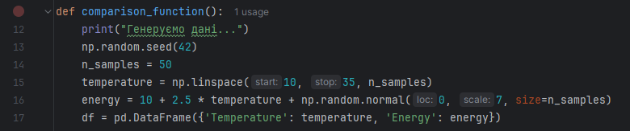
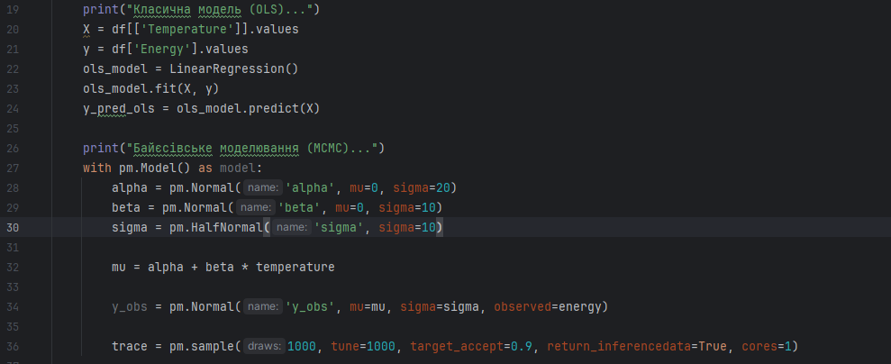

# Практична робота №4
Цей репозиторій cтворений для перегляду виконання практичної роботи №4 з дисципліни "Технології збору та обробки даних", виконане студентом Щур Р.І., групи ТВ-32.

## Мета роботи:
Реалізація байєсівської регресії та її порівняння з класичною лінійною регресією.
## Поставлені завдання:
Реалізуйте байєсівську регресію для моделювання залежностей між погодними умовами та енергоспоживанням. Порівняйте отримані висновки з результатами, отриманими за допомогою класичної лінійної регресії. Побудуйте графіки для візуалізації отриманих залежностей.

## Програмна реалізація:

Для подальшої роботи програми було згенеровано набір тестових даних. Для відтворюваності результатів під час наступних запусків використовується фіксація стану генератора випадкових чисел за допомогою np.random.seed(42). Набір даних складається з лінійної послідовності 50 значень температури в діапазоні від 10°C до 35°C. Енергоспоживання моделюється формулою 10 + 2,5 * температура. Для імітації реальних умов до результатів додано випадкову похибку (шум) із середнім значенням 0 та розкидом у 7 одиниць. Згенеровані дані структуровано у форматі pandas.DataFrame.

Класична лінійна регресія реалізується за допомогою бібліотеки scikit-learn, яка методом найменших квадратів (OLS) знаходить єдине оптимальне значення для коефіцієнтів нахилу та перетину. Байєсівська регресія реалізується з використанням фреймворку ймовірнісного програмування PyMC. У цій моделі параметри не є константами, а визначаються як випадкові величини з заданими апріорними розподілами (нормальним для коефіцієнтів та напівнормальним для похибки). Процес знаходження апостеріорних розподілів реалізовано через алгоритм марковських ланцюгів Монте-Карло (MCMC) з використанням семплера NUTS. 

Завершальний етап включає статистичний аналіз результатів за допомогою бібліотеки ArviZ та комплексну візуалізацію, де на одному графіку поєднуються фактичні дані, жорстка лінія класичної регресії та хмара ймовірних станів Байєсівської моделі, що наочно демонструє ступінь невизначеності прогнозів.
